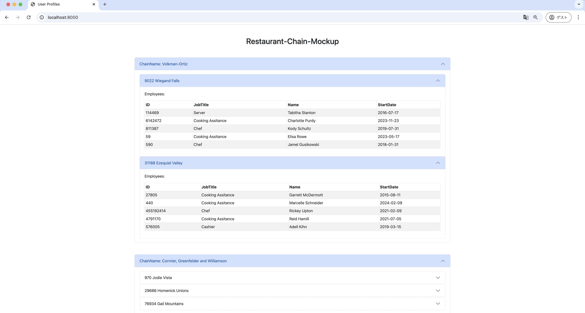

# Restaurant Chain Prototype

[サイトURL](https://userlorem.ryosuke-tech.com)

    

### 使用技術
**フロントエンド**

**バックエンド**

**インフラ**

&nbsp;

## 概要
チェーンレストランを模したウェブサイトを開発しました。 
このサイトでは、架空のデータを含んだレストランのページを動的に生成します。
PHP 8.2で構築されており、強い型付けと多彩なオブジェクト指向プログラミング（OOP）機能が特徴です。
エントリーポイントはオートローダーを利用しており、必要なファイルやComposerの依存性（この場合はfakerライブラリ）を自動で読み込みます。
 

バックエンド設計は「実装ではなくインターフェースに基づく設計」の原則に基づいており、FileConvertibleインターフェースを実装する任意のクラスに対して動作する汎用的なコードで、クラスの内容を出力します。
FileConvertibleは、オブジェクトが自分自身を文字列、HTML、マークダウン、または連想配列に変換する機能を持つことを要求します。

<!--ユーザーはHTMLフォームを介して、従業員数、範囲、場所を選択し、モックデータをHTML、JSON、TXT、マークダウンのいずれかの形式でダウンロードすることができます-->
&nbsp;

## クラス図
- Employee クラス（User クラスを拡張）
    - 職種（string）: 従業員の職種
    - 給与（float）: 従業員の給与
    - 開始日（DateTime）: 従業員がレストランでの雇用を開始した日付
    - 賞（array）: 従業員が獲得した賞の配列
- Company クラス
    - 会社名（string）: 会社の名称
    - 設立年（int）: 会社が設立された年
    - 説明（string）: 会社の簡単な説明
    - ウェブサイト（string）: 会社の公式ウェブサイトの URL
    - 電話（string）: 会社の連絡先電話番号
    - 業界（string）: 会社が事業を展開している業界
    - CEO（string）: 会社の CEO の名前
    - 公開取引の有無（bool）: 会社が公開取引されているかどうかを示します
- RestaurantChain クラス（Company クラスを拡張）
    - チェーン ID（int）: レストランチェーンの一意の識別子
    - レストランの場所（array）: レストランチェーンの異なる場所を表す RestaurantLocation オブジェクトの配列
    - 料理の種類（string）: レストランチェーンで提供される料理の種類
    - 場所の総数（int）: チェーン内のレストランの総数
    - ドライブスルーの有無（bool）: チェーンのレストランにドライブスルーがあるかどうかを示します
    - 設立年（int）: レストランチェーンが設立された年
    - 親会社（string）: 親会社の名前（該当する場合）

## 開発環境
| インフラ | バージョンなど |
| :------- | :------ |
| AWS EC2 | Ubuntu |
| Ubuntu | 22.04.4 LTS |

&nbsp;

| OS・言語・ライブラリ | バージョン |
| :------- | :------ |
| PHP | 8.3.11 |
| fakerphp/faker | 1.23.1 |
| HTML5 | - |
| CSS3 | - |
| Bootstrap | - |
 

&nbsp;